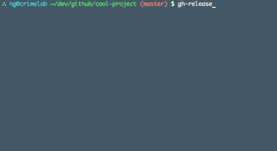

# gh-release

> Create a release for a node package on GitHub.

[![npm][npm-image]][npm-url]
[![travis][travis-image]][travis-url]

[npm-image]: https://img.shields.io/npm/v/gh-release.svg?style=flat-square
[npm-url]: https://www.npmjs.com/package/gh-release
[travis-image]: https://img.shields.io/travis/ungoldman/gh-release.svg?style=flat-square
[travis-url]: https://travis-ci.org/ungoldman/gh-release

Uses the [Github Releases API](https://developer.github.com/v3/repos/releases/) to create a new release. Defaults to using information from `package.json` and `CHANGELOG.md`.



## Install

```
$ npm install gh-release
```

## Usage

### Command-line interface

```
$ gh-release
Your GitHub username: ungoldman
Your GitHub password: ✔✔✔✔✔✔✔✔

creating release v1.0.0 for ungoldman/cool-project

name:               v1.0.0
tag_name:           v1.0.0
target_commitish:   9561804a4d1fca2525d3207bec4907dd5ec7a705
body:               * engage

? publish release to github? Yes
https://github.com/ungoldman/cool-project/releases/tag/v1.0.0
```

Should be run at the root of the project to be released.

Expects a `package.json` and `CHANGELOG.md` in the working directory.

Prints release URL to terminal on success.

Saves Github API token to `$HOME/.config/gh-release.json` after first authentication.

Get usage info by running with `--help` or `-h`.

```
$ gh-release --help
Usage: gh-release [options]

Examples:
  node bin/cli.js -n v1.1.8 -c master -d    create a draft release with title v1.1.8 tagged at HEAD of master


Options:
  -t, --tag_name          tag for this release
  -c, --target_commitish  commitish value for tag
  -n, --name              text of release title
  -b, --body              text of release body
  -o, --owner             repo owner
  -r, --repo              repo name
  -d, --draft             publish as draft                     [default: false]
  -p, --prerelease        publish as prerelease                [default: false]
  --dry-run               dry run (stops before release step)  [default: false]
  -w, --workpath          path to working directory            [default: <current working directory>]
  -a, --assets            list of assets to upload to release  [default: false]
  -h, --help              Show help
  -v, --version           Show version number
```

### Node API

```js
var ghRelease = require('gh-release')

// all options have defaults and can be omitted
var options = {
  tag_name: 'v1.0.0',
  target_commitish: 'master',
  name: 'v1.0.0',
  body: '* init\n',
  draft: false,
  prerelease: false,
  repo: 'gh-release',
  owner: 'ungoldman'
}

// options can also be just an empty object
var options = {}

// auth is required
// it can either be a username & password...
options.auth = {
  username: 'ungoldman',
  password: 'XXXXXXXX'
}

// or an API token
options.auth = {
  token: 'XXXXXXXX'
}

ghRelease(options, function (err, result) {
  if (err) throw err
  console.log(result) // create release response: https://developer.github.com/v3/repos/releases/#response-4
})
```

## Defaults

All default values taken from `package.json` unless specified otherwise.

| name | description | default |
| ---: | ----------- | ------- |
| `tag_name` | release tag | 'v' + `version` |
| `target_commitish` | commitish value to tag | HEAD of current branch |
| `name` | release title | 'v' + `version` |
| `body` | release text | `CHANGELOG.md` section matching `version` |
| `owner` | repo owner | repo owner parsed out of `repository.url` |
| `repo` | repo name | repo name parsed out of `repository.url` |
| `draft` | publish as draft | false |
| `prerelease` | publish as prerelease | false |
| `assets` | release assets to upload | false |

Override defaults with flags (CLI) or the `options` object (node).

## Standards

* `CHANGELOG.md`: http://keepachangelog.com
* `package.json`: https://docs.npmjs.com/files/package.json

## Example

All [releases](https://github.com/ungoldman/gh-release/releases) of `gh-release` were created with `gh-release`.

## Motivation

There are packages that already do something like this, and they're great, but I want something that does this one thing really well and nothing else, leans heavily on standards in `package.json` and `CHANGELOG.md`, and can work both as a CLI tool and programmatically in node.

## Contributing

Contributions welcome! Please read the [contributing guidelines](CONTRIBUTING.md) first.

## License

[ISC](LICENSE.md)
